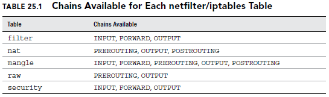

## Working with firewalls
- Yocto install `nmap`
- Yocto install `firewalld`
- `iptables`: kernel-level firewall feature. 
  - It is most commonly used to allow or block access from outside systems to the services running on your local system. 
  - It works by allowing you to create rules that can be applied to every packet that tries to enter (INPUT), leave (OUTPUT), or cross through your system (FORWARD).

### Understanding firewalls
- just a filter that checks each network packet or application request coming into or out of a computer system or network.

### Implementing firewalls
- On a Linux system, the firewall is a host-based, network-layer, software firewall managed by the `iptables` utility and related kernel-level components
- firewalld service to provide a more dynamic way of managing firewall rules than were offered previously
  - The Firewall Configuration window (firewall-config command) provides an easy way to open ports on your firewall and do masquerading (routing private addresses to a public network) or port forwarding.
  - The firewalld service can react to changes in conditions, which the static iptables service can’t do as well on its own.

### Understanding the iptables utility
Basic concepts to study:
- tables
- chains
- policies
- rules
- 
#### Tables
- It defines what type of firewall functionality is taking place
- There are 4:
- `filter`: It is the packet filtering feature of the firewall. In this table, access control decisions are made for packets traveling to, from, and through your Linux system
- `nat`: for Network Address Translation (NAT). NAT table rules let you redirect where a packet goes
- `mangle`: packets are mangled (modified) according to the rules in the mangle table. Using the mangle table directly is less common and typically done to change how a packet is  managed.
- `raw`: to exempt certain network packets from something called “connection tracking.” This feature is important when you are using Network Address Translation and virtualization on your Linux server.

### Chains
- the `netfilter/iptables` firewall categorizes network packets into categories, called `chains`. There are five chains (categories) to which a network packet can be designated.
  - `input` Network packets coming into the Linux server
  - `forward` Network packets coming into the Linux server that are to be routed out through another network interface on the server
  - `output` Network packets coming out of the Linux server
  - `prerouting` Used by NAT for modifying network packets when they come into the Linux server
  - `postrouting` Used by NAT for modifying network packets before they come out of the Linux server
- After a network packet is categorized into a specific chain, iptables can determine what policies or rules apply to that particular packet.
 


### Rules, Policies and targets
- For each network packet, a rule can be set up defining what to do with that individual packet. Network packets can be identified many ways by the netfilter/iptables firewall.
  - Source IP address
  - Destination IP address
  - Network protocol
  - Inbound port
  - Outbound port
  - Network State
- NOTE: If no rule exists for a particular packet, then the overall policy is used. Each packet category or chain has a default policy.
- After a network packet matches a particular rule or falls to the default policy, then action on the packet can occur. The action taken depends upon what iptables target is set. Here are a couple of actions (targets) that can be taken:
  - `ACCEPT` Network packet is accepted into the server
  - `REJECT` dropped and not allowed into the server. A rejection message is sent.
  - `DROP` dropped and not allowed into the server. No rejection message is sent.

The iptables utility implements a software firewall using the filter table via policies and rules.

## Using iptables utility
- To see what policies and rules are currently in place for the filter:
  - `iptables -vnL`: 
  ```
  Chain INPUT (policy ACCEPT)
  target prot opt source    destination
  Chain FORWARD (policy ACCEPT)
  target prot opt source    destination
  Chain OUTPUT (policy ACCEPT)
  target prot opt source    destination
  ```
  - meaning: the firewall is wide open with no restrictions implemented. No rules are set, and the policies are all set to `ACCEPT`.

### Modifying iptables policies and rules