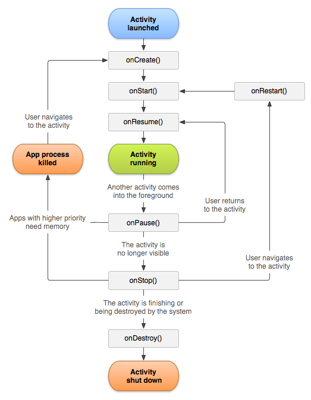

## V100 Activity
- Representa a tela do aplicativo (esta pode conter textos botoes etc)
- A tela de um aplicativo é composta de dois arquivos:
  - Uma clase kotlin
  - Um arquivo xml
- Para criar uma: `java/com..../richt click/New/Activity/Empty Activity`
  - O nome deve ser: `<dummydetails>+Activity`
  - Yes in `Generate a Layout File`
  - Layout Name: `activity_<dummydetails>`
  - Source: `Kotlin`
## V101 Navegacao entre activities
- Android utiliza pila de navegação. Cada UI é sopreposta  anterior.
  - Abrindo uma nova activity:
    - Se utiliza o metodo `startActivity` para abrir uma nova tela utilizando de parametro um objeto `intent` :
       - `startActivity(intent)` onde intent
         - `Intent(contexto, activityToOpen)`
- Ejemplo:
1. Na mainActivity se cria um button con id `button_newActivity`
2. se cria uma variavel no arquivo `.kt` para asociar com o button. ( logicamente se utiliza `lateinit`, para inicializar ela depois neste caso no método `onCreate`)
3. No método `setOnClickListener` se cria um `intent` 
   1. o primeiro parametro é de onde o intent vai partir , como é apartir da activity actual se utiliza `this`
   2. o segundo parametro é a classe que vai ser utilizada: para um novo layout `activity_dummy.xml` com codigo em `dummyActivity.kt`  o parametro seria : `dummyActivity::class.java` 
4. Finalmente se chama a nova activity com `startActivity(intent)`

``` kt
// lateinit para inicializar a variavel depois (neste caso no metodo onCreate)
lateinit var buttonAbrir : Button
override fun onCreate(savedInstanceState: Bundle?) {
        super.onCreate(savedInstanceState)
        enableEdgeToEdge()
        setContentView(R.layout.activity_main)

        ViewCompat.setOnApplyWindowInsetsListener(findViewById(R.id.main)) { v, insets ->
            val systemBars = insets.getInsets(WindowInsetsCompat.Type.systemBars())
            v.setPadding(systemBars.left, systemBars.top, systemBars.right, systemBars.bottom)
            insets
        }

        // A partir daqui
        //Asociamos o botao a o view com id: button_newActivity
        buttonAbrir = findViewById(R.id.button_newActivity)
        buttonAbrir.setOnClickListener {
            val intent  = Intent(this,
                dummyActivity::class.java)

            startActivity(intent)
        }    
  }
```
1. Para voltar a tela anterior se cria um botao na nova activity e se chama ao metodo `finish`
``` kt
// lateinit para inicializar a variavel depois (neste caso no metodo onCreate)
lateinit var buttonCerrar : Button

    override fun onCreate(savedInstanceState: Bundle?) {
        super.onCreate(savedInstanceState)
        enableEdgeToEdge()
        setContentView(R.layout.activity_dummy)
        ViewCompat.setOnApplyWindowInsetsListener(findViewById(R.id.main)) { v, insets ->
            val systemBars = insets.getInsets(WindowInsetsCompat.Type.systemBars())
            v.setPadding(systemBars.left, systemBars.top, systemBars.right, systemBars.bottom)
            insets
        }
        // A partir daqui
        buttonCerrar = findViewById(R.id.button_go_back)
        buttonCerrar.setOnClickListener {
            finish()
        }
  }
```

## V102 Ciclo de Vida de uma Activity

