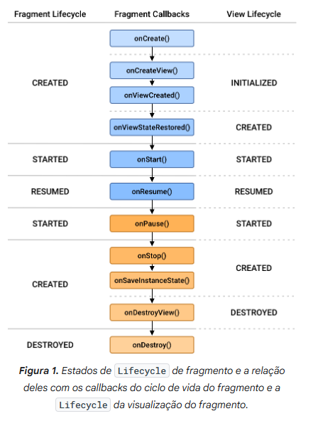

## V100 Activity
- Representa a tela do aplicativo (esta pode conter textos botoes etc)
- A tela de um aplicativo é composta de dois arquivos:
  - Uma clase kotlin
  - Um arquivo xml
- Para criar uma: `java/com..../richt click/New/Activity/Empty Activity`
  - O nome deve ser: `<dummydetails>+Activity`
  - Yes in `Generate a Layout File`
  - Layout Name: `activity_<dummydetails>`
  - Source: `Kotlin`
## V101 Navegacao entre activities
- Android utiliza pila de navegação. Cada UI é sopreposta  anterior.
  - Abrindo uma nova activity:
    - Se utiliza o metodo `startActivity` para abrir uma nova tela utilizando de parametro um objeto `intent` :
       - `startActivity(intent)` onde intent
         - `Intent(contexto, activityToOpen)`
- Ejemplo:
1. Na mainActivity se cria um button con id `button_newActivity`
2. se cria uma variavel no arquivo `.kt` para asociar com o button. ( logicamente se utiliza `lateinit`, para inicializar ela depois neste caso no método `onCreate`)
3. No método `setOnClickListener` se cria um `intent` 
   1. o primeiro parametro é de onde o intent vai partir , como é apartir da activity actual se utiliza `this`
   2. o segundo parametro é a classe que vai ser utilizada: para um novo layout `activity_dummy.xml` com codigo em `dummyActivity.kt`  o parametro seria : `dummyActivity::class.java` 
4. Finalmente se chama a nova activity com `startActivity(intent)`

``` kt
// lateinit para inicializar a variavel depois (neste caso no metodo onCreate)
lateinit var buttonAbrir : Button
override fun onCreate(savedInstanceState: Bundle?) {
        super.onCreate(savedInstanceState)
        enableEdgeToEdge()
        setContentView(R.layout.activity_main)

        ViewCompat.setOnApplyWindowInsetsListener(findViewById(R.id.main)) { v, insets ->
            val systemBars = insets.getInsets(WindowInsetsCompat.Type.systemBars())
            v.setPadding(systemBars.left, systemBars.top, systemBars.right, systemBars.bottom)
            insets
        }

        // A partir daqui
        //Asociamos o botao a o view com id: button_newActivity
        buttonAbrir = findViewById(R.id.button_newActivity)
        buttonAbrir.setOnClickListener {
            val intent  = Intent(this,
                dummyActivity::class.java)

            startActivity(intent)
        }    
  }
```
1. Para voltar a tela anterior se cria um botao na nova activity e se chama ao metodo `finish`
``` kt
// lateinit para inicializar a variavel depois (neste caso no metodo onCreate)
lateinit var buttonCerrar : Button

    override fun onCreate(savedInstanceState: Bundle?) {
        super.onCreate(savedInstanceState)
        enableEdgeToEdge()
        setContentView(R.layout.activity_dummy)
        ViewCompat.setOnApplyWindowInsetsListener(findViewById(R.id.main)) { v, insets ->
            val systemBars = insets.getInsets(WindowInsetsCompat.Type.systemBars())
            v.setPadding(systemBars.left, systemBars.top, systemBars.right, systemBars.bottom)
            insets
        }
        // A partir daqui
        buttonCerrar = findViewById(R.id.button_go_back)
        buttonCerrar.setOnClickListener {
            finish()
        }
  }
```

## V102 Ciclo de Vida de uma Activity
LINK : [HERE](https://developer.android.com/guide/components/activities/activity-lifecycle?hl=pt-br)


- onCreate: Ele é acionado assim que o sistema cria a atividade. Quando a atividade é criada, ela insere o estado Criado. No método onCreate(), execute a lógica básica de inicialização do aplicativo que acontece apenas uma vez durante toda a vida útil da atividade.
- onStart: Essa chamada torna a atividade visível para o usuário enquanto o app se prepara para que a atividade entre em primeiro plano e se torne interativa. Por exemplo, é nesse método que o código que mantém a IU é inicializado.
- onResume: Quando a atividade entra no estado "Retomado", ela vem para o primeiro plano e o sistema invoca o callback onResume(). É nesse estado que o aplicativo interage com o usuário. O app permanece nesse estado até que algo aconteça para tirar o foco do app, por exemplo, o dispositivo receber uma ligação, o usuário navegar para outra atividade ou desligar a tela do dispositivo.
  - Quando a atividade é movida para o estado "Retomado", qualquer componente ciente do ciclo de vida vinculado ao ciclo de vida da atividade recebe o evento ON_RESUME. É nesse momento que os componentes do ciclo de vida podem ativar qualquer funcionalidade que precise operar enquanto o componente estiver visível e em primeiro plano, como o início da visualização da câmera.
  - Quando ocorre um evento de interrupção, a atividade entra no estado Pausado e o sistema invoca o callback onPause().
  - Se a atividade retornar do estado "Pausado" para o estado "Retomado", o sistema chamará novamente o método onResume(). Por esse motivo, implemente onResume() para inicializar os componentes liberados durante onPause() e para executar outras inicializações que precisam ocorrer sempre que a atividade entrar no estado "Retomado".
- onPause: O sistema chama esse método como o primeiro indício de que o usuário está saindo da atividade, embora nem sempre isso signifique que a atividade vai ser destruída. Isso indica que a atividade não está mais em primeiro plano, mas ainda estará visível se o usuário estiver no modo de várias janelas.
- onStop: Quando a atividade não está mais visível para o usuário, ela entra no estado Interrompido e o sistema invoca o callback onStop(). Isso pode ocorrer quando uma atividade recém-iniciada cobre toda a tela. O sistema também chama onStop() quando a atividade termina de ser executada e está prestes a ser encerrada.
- onDestroy: onDestroy() é chamado antes de a atividade ser destruída. O sistema invoca esse callback por um destes dois motivos:
  - A atividade está sendo concluída porque o usuário descartou completamente a atividade ou porque finish() está sendo chamado na atividade.
  - O sistema está destruindo temporariamente a atividade devido a uma mudança na configuração, como a rotação do dispositivo ou a entrada no modo de várias janelas.
  - A partir do estado "Interrompido", a atividade volta a interagir com o usuário ou para de operar e é encerrada. Se a atividade voltar, o sistema invocará onRestart(). Caso a Activity deixe de operar, o sistema chamará onDestroy().

- Exemplo: É utilizado o exemplo anterior como base
  - No mainactiviy é possivel criar os seguintes métodos (apresentados a seguir) 
    - NOTA: No método de log `Log.i` Primeiro parametro é p tag do log, o outro é o conteudo
    - Os logs sao printados no `Logcat` onde da pra filtrar por `tag`

``` kt 
class MainActivity : AppCompatActivity() {

    lateinit var buttonAbrir : Button
    override fun onCreate(savedInstanceState: Bundle?) {
        super.onCreate(savedInstanceState)
        enableEdgeToEdge()
        setContentView(R.layout.activity_main)

        ViewCompat.setOnApplyWindowInsetsListener(findViewById(R.id.main)) { v, insets ->
            val systemBars = insets.getInsets(WindowInsetsCompat.Type.systemBars())
            v.setPadding(systemBars.left, systemBars.top, systemBars.right, systemBars.bottom)
            insets
        }

        buttonAbrir = findViewById(R.id.button_newActivity)

        buttonAbrir.setOnClickListener {
            val intent  = Intent(this,
                dummyActivity::class.java)

            startActivity(intent)
        }
        Log.i("lifecycle_lobo","OnCreate") 
    }

    override fun onStart() {
        super.onStart()
        Log.i("lifecycle_lobo","OnStart")
    }

    override fun onResume() {
        super.onResume()
        Log.i("lifecycle_lobo","OnResume")
    }

    override fun onPause() {
        super.onPause()
        Log.i("lifecycle_lobo","OnPause")
    }

    override fun onStop() {
        super.onStop()
        Log.i("lifecycle_lobo","OnStop")
    }

    override fun onDestroy() {
        super.onDestroy()
        Log.i("lifecycle_lobo","OnDestroy")
    }

    override fun onRestart() {
        super.onRestart()
        Log.i("lifecycle_lobo","OnRestart")
    }
}
```
- Resultados:
  - Inicio da aplicação é apresentada a tela do `MainActivity`
    - Log: `OnCreate OnStart OnResume`    
  - Botao `Go to new Activity` foi apertado e nova activity é apresentada:
    - Log: `OnPause OnStop`
  - Botao voltar pra mainactivity é apertado e mainactivity é apresenta
    - Log: `OnRestart OnStart OnResume`
  - Botao main é apertado e tela de inicio do android é apresentada
    - Log: `OnPause OnStop`
  - Voltamos ao app
    - Log: `OnRestart OnStart OnResume`
  - App fechado
    - Log: `OnPause OnStop OnDestroy`

## V103 Passando dados entre activities
- Os valores sao enviados no `Intent` utilizando o método `putExtra`
- Exemplo: É utilizado o exemplo anterior como base
1. No MainActivity.kt 
``` kt
buttonAbrir.setOnClickListener {
            val intent  = Intent(this,
                dummyActivity::class.java)

            // Aqui sao setados os dados
            intent.putExtra("dummy_double",73.90)
            intent.putExtra("dummy_int",4888)
            intent.putExtra("dummy_string","This is a Message from MainActivity")

            startActivity(intent)
        } 
```
2. Criar um TextView no na outra activity layout com `id = txt_dummy`
3. O Codigo no activity é o seguinte:
``` kt
class dummyActivity : AppCompatActivity() {

    lateinit var buttonCerrar : Button
    lateinit var txtDummy : TextView // Pra utilizar o TextView

    override fun onCreate(savedInstanceState: Bundle?) {
        super.onCreate(savedInstanceState)
        enableEdgeToEdge()
        setContentView(R.layout.activity_dummy)
        ViewCompat.setOnApplyWindowInsetsListener(findViewById(R.id.main)) { v, insets ->
            val systemBars = insets.getInsets(WindowInsetsCompat.Type.systemBars())
            v.setPadding(systemBars.left, systemBars.top, systemBars.right, systemBars.bottom)
            insets
        }

        buttonCerrar = findViewById(R.id.button_go_back)
        txtDummy = findViewById(R.id.txt_dummy) //Carregando o TextView

        val bundle = intent.extras // Aqui tem todos os parametros adicionados com PutExtra
        if( bundle != null) //Proteçao caso retorne null
        {
          //Variaveis utilizadas na activity anterior
            val dummy_message = bundle.getString("dummy_string")
            val dummy_int = bundle.getInt("dummy_int")
            val dummy_double = bundle.getDouble("dummy_double")

            //Mensagem que agrupa todas elas 
            val result = "Msg: $dummy_message , Int: $dummy_int , double: $dummy_double"
            // Assignar o resultado
            txtDummy.text = result
        }

        buttonCerrar.setOnClickListener {
            finish()
        }
    }
}
```

## V104 Passando objetos entre activities
- Exemplo: É utilizado o exemplo anterior como base
1. Adicionar o seguinte pacote `id("org.jetbrains.kotlin.plugin.parcelize")` no `build.gradle.kts` 

``` 
plugins {
    alias(libs.plugins.android.application)
    alias(libs.plugins.jetbrains.kotlin.android)
    id("org.jetbrains.kotlin.plugin.parcelize")    
}

```
2. Criar uma `new kotlin data class` e.g. `DummyPerson`
``` kt
//Pacotes nescesarios
import android.os.Parcelable
import kotlinx.android.parcel.Parcelize

@Parcelize  //Para que o compilador parserise o construtor
data class DummyPerson(val name: String, val surname: String, val age: Int) : Parcelable //Implementa a interface
```
3. Criar um objeto do tipo `DummyPerson` e adicionar no `intent.PutExtra`
``` kt
lateinit var buttonAbrir : Button
    override fun onCreate(savedInstanceState: Bundle?) {
        super.onCreate(savedInstanceState)
        enableEdgeToEdge()
        setContentView(R.layout.activity_main)

        ViewCompat.setOnApplyWindowInsetsListener(findViewById(R.id.main)) { v, insets ->
            val systemBars = insets.getInsets(WindowInsetsCompat.Type.systemBars())
            v.setPadding(systemBars.left, systemBars.top, systemBars.right, systemBars.bottom)
            insets
        }

        buttonAbrir = findViewById(R.id.button_newActivity)

        buttonAbrir.setOnClickListener {
            val intent  = Intent(this,
                dummyActivity::class.java)

            // CRIANDO OBJETO
            val dummyPerson = DummyPerson("Rufa", "VonRufinstein", 12)
            //ADICIONANDO NO INTENT
            intent.putExtra("person", dummyPerson)

            startActivity(intent)
        }        
    }
```
4. O método `getParcelable` tem duas implementações para versoes menores e maiores a versção 33. Por tanto tem que se implementar as duas.
```
lateinit var buttonCerrar : Button
    lateinit var txtDummy : TextView

    override fun onCreate(savedInstanceState: Bundle?) {
        super.onCreate(savedInstanceState)
        enableEdgeToEdge()
        setContentView(R.layout.activity_dummy)
        ViewCompat.setOnApplyWindowInsetsListener(findViewById(R.id.main)) { v, insets ->
            val systemBars = insets.getInsets(WindowInsetsCompat.Type.systemBars())
            v.setPadding(systemBars.left, systemBars.top, systemBars.right, systemBars.bottom)
            insets
        }

        buttonCerrar = findViewById(R.id.button_go_back)
        txtDummy = findViewById(R.id.txt_dummy)

        val bundle = intent.extras // Aqui tem todos os parametros adicionados com PutExtra
        if( bundle != null)
        {
            //OBTENDO BUNDLE PARA VERSOES MAIORES A 33
            val person = if( Build.VERSION.SDK_INT >= 33){
                bundle.getParcelable("person", DummyPerson::class.java)
            }else{
                bundle.getParcelable("person")
            }

            //B
            val result = "Name: ${person?.name} , Sobrenome: ${person?.surname}  , Idade: ${person?.age} "
            txtDummy.text = result
        }

        buttonCerrar.setOnClickListener {
            finish()
        }
    }
```

## V107 - Introdução aos fragments
- São partes reutilizaveis da interface de usuário
- Definem e gerenciam o proprop layout, tem ciclo de vida proprio e pode processar eventos de entrada.
- Nao existem por conta propria precisam ser hospedados dentro de uma `activity` ou por outro `fragment`

## V108 Criando interface para Fragment 
- Utiliza `FragmentContainerView`
  - Precisa de ter `fragments` previamente criados

## V109 - Criando um fragment
- Duas formas:
  - Usando XML
  - Programaticamente
- `Right Click on Package / New/Fragment/ Fragment (Blank)`
  - Coding style Fragment Name: `<dummyName>Fragment.kt` e Fragment Layout Name: `fragment_<dummyName>`
- Ao adicionar um `FragmentContainerView` vao aparecer dois erros:
  - `Unknown Fragments`: Recomenda que en quanto estiver utilizando o Android Studio, deve utilizar o `@layout/fragment_<dummyName>` para renderizar
    - Ao ver o código vemos o seguinte:
    ``` xml
    <androidx.fragment.app.FragmentContainerView
        android:id="@+id/fragmentContainerView"
        android:name="com.redtowersoft.s8.Test1Fragment"
        android:layout_width="wrap_content"
        android:layout_height="wrap_content"
        tools:layout_editor_absoluteX="134dp"
        tools:layout_editor_absoluteY="219dp"
        tools:layout="@layout/fragment_test1" />
    ```
    - No caso do meu fragment criado deu `tools:layout="@layout/fragment_test1"`
    - Lembrando que `tools:` recursos que funcionan no android studio porem na hora de compilar nao serao levados em consideração.
  - `Missing Constraints in Constraing Layout`:

- Exemplo: 
1. Criar um namespace `fragment` (folder)
2. Criar uma nova `kotlin` class e que ela herde de `Fragment`. Implementar o default do método `onCreateView`. Assumindo um nome `Dummy1Fragment`. O codigo deve ficar assim.
``` kt
class Dummy1Fragment : Fragment() {

    override fun onCreateView(
        inflater: LayoutInflater,
        container: ViewGroup?,
        savedInstanceState: Bundle?
    ): View? {
        return super.onCreateView(inflater, container, savedInstanceState)
    }
}
```
3. Criar um novo layout resource com nome `fragment_dummy1`
   1. Temporalmente pode ser criado um txt com o nome do ffragment nele para poder reconhecer facil durante a implementação.
4. Para assignar a nova classe ao novo layout se utiliza o método `inflate`:
   1. `R.layout.fragment_dummy1`: O fragment que queremos
   2. `container`: pq vai ser contido num contianer
   3. `false`: false para montagem automatica, true pra manual
``` kt
class Dummy1Fragment : Fragment() {

    override fun onCreateView(
        inflater: LayoutInflater,
        container: ViewGroup?,
        savedInstanceState: Bundle?
    ): View? {
        val fragView = inflater.inflate(
            R.layout.fragment_dummy1,
            container,
            attachToRoot: false)
        
        return fragView
    }
}
```

5. Mudar o xml da activity que vai conter ele para o fragment escolhido
``` xml
<androidx.fragment.app.FragmentContainerView
        android:id="@+id/fragmentContainerView2"
        android:name="com.redtowersoft.s8.fragments.Dummy1Fragment"
        android:layout_width="0dp"
        android:layout_height="0dp"
        tools:layout="@layout/fragment_dummy1"
        app:layout_constraintBottom_toBottomOf="parent"
        app:layout_constraintEnd_toEndOf="parent"
        app:layout_constraintHorizontal_bias="0.497"
        app:layout_constraintStart_toStartOf="parent"
        app:layout_constraintTop_toTopOf="@+id/guideline" />
```

## V110 Navegando pelos fragments
- Se utiliza o `fragmentManager` e dois métodos:
  - `.beginTransaction`: inicia operação
  - `.commit`: confirma operação
  - As operações podem ser:
    - `add`: vai sobrepor um fragment acima do outro
    - `replace`: substitui caso exista outro frament
    - `remove`
- Exemplo:É utilizado o exemplo anterior como base
1. Dar id ao `fragmentContainerView` e.g. `fgContainer`
2. Dentro do OnCreate da activity da pra botar o seguinte codigo:
   1. Este seria o template:
   ``` kt
    val fragmentManager = supportFragmentManager.beginTransaction()
        fragmentManager.add(R.id.<Id do Fragment Container>, <Classe do Fragment>())
        fragmentManager.commit()
    ``` 
   2. ou seja
   ``` kt
   val fragmentManager = supportFragmentManager.beginTransaction()
        fragmentManager.add(R.id.fgContainer, Dummy1Fragment())
        fragmentManager.commit()
   ``` 
3. Outra forma seria utilizando botoes digamos que temos dois botoes no Activity com ids `button_frag1` e `button_frag2` codigo a seguir:
   
``` kt
class FragmentTestActivity : AppCompatActivity() {

    lateinit var btn_dummy1 : Button
    lateinit var btn_dummy2 : Button

    override fun onCreate(savedInstanceState: Bundle?) {
        super.onCreate(savedInstanceState)
        enableEdgeToEdge()
        setContentView(R.layout.activity_fragment_test)
        ViewCompat.setOnApplyWindowInsetsListener(findViewById(R.id.main)) { v, insets ->
            val systemBars = insets.getInsets(WindowInsetsCompat.Type.systemBars())
            v.setPadding(systemBars.left, systemBars.top, systemBars.right, systemBars.bottom)
            insets
        }

        //Asignar os ids aos botoes
        btn_dummy1 = findViewById(R.id.button_frag1)
        btn_dummy2 = findViewById(R.id.button_frag2)

        //É boa pratica instanciar fora os fragments para depois utilizar
        val fgDummy1Instance = Dummy1Fragment()
        val fgDummy2Instance = Dummy2Fragment()

        //Assignar os métodos aos botoes
        btn_dummy1.setOnClickListener{
            val fragmentManager = supportFragmentManager.beginTransaction()
            fragmentManager.replace(R.id.fgContainer, fgDummy1Instance)
            fragmentManager.commit()
        }

        btn_dummy2.setOnClickListener{
            val fragmentManager = supportFragmentManager.beginTransaction()
            fragmentManager.replace(R.id.fgContainer, fgDummy2Instance)
            fragmentManager.commit()
        }
    }
}
```
## V111 Ciclo de Vida dos fragments


## V112 Actions com fragmentos

## V113 Passando parametros para fragments

## Usando  Fragment da extensaoKTX